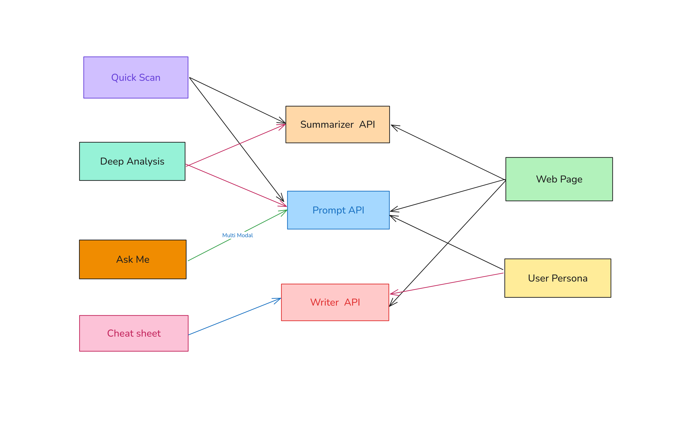

# DocuMentor AI

> **Your AI-Powered Learning Companion for Documentation**


---

## 🎥 Demo Video

[**Watch the Demo**](#) _(Link to demo video)_

See DocuMentor AI in action - from personalized page analysis to AI-powered explanations!

---

## What is DocuMentor AI?

Ever felt overwhelmed reading technical documentation? Wondering if you're ready for that advanced tutorial, or if you should start with the basics first? **DocuMentor AI** is here to help!

This Chrome extension acts as your personal learning companion, using Chrome's powerful **built-in AI APIs** to:

- 📊 **Analyze documentation** and tell you if it matches your skill level
- 📝 **Generate cheat sheets** from any webpage for quick reference
- 💬 **Explain complex concepts** in simple terms (even images and diagrams!)
- 🎯 **Recommend learning resources** personalized to your needs
- 🧠 **Remember your learning journey** and adapt to your growing skills

The best part? **Everything runs locally** on your device using Chrome's Gemini Nano model. Your data never leaves your browser.

---

## 🎯 The Secret Sauce: User Persona System

What makes DocuMentor AI different? **Personalization powered by AI.**

When you first use the extension, you'll create your **learning persona** - a profile that includes:

- Your role (student, developer, architect, etc.)
- Your technical skills and confidence levels
- Your learning goals
- Your preferred learning style (visual, reading, hands-on, or mixed)

Here's the magic: **Every single AI feature uses your persona** to tailor its responses!

**Example:**

- A **beginner** reading React docs gets explanations about JSX and components in simple terms
- An **expert** reading the same docs gets advanced patterns, performance tips, and architecture insights

Your persona evolves with you - track your progress, update skills, and watch the AI adapt to your growth!

---

## ✨ Features Powered by Chrome Built-in AI

DocuMentor AI leverages **three Chrome AI APIs** to create a comprehensive learning experience:

### 1. 📊 Quick Scan

**APIs Used:** Summarizer API + Prompt API

Get an instant overview of any documentation page:

- **What it covers** - AI-generated summary of the page content
- **Should you read this?** - Personalized recommendation based on your goals
- **Page structure** - Outline of headings and sections
- **Related resources** - AI-curated links for deeper learning

**Use Case:** You land on a 10,000-word tutorial. Quick Scan tells you in 30 seconds if it's right for your level and what you'll learn.

---

### 2. 🔍 Deep Analysis

**APIs Used:** Summarizer API + Prompt API

Go beyond the surface with comprehensive analysis:

- **Overview** - Detailed summary of the content
- **Code patterns** - Analysis of code examples and their frequency
- **Video recommendations** - YouTube videos matched to the topic and your level
- **Related reading** - Categorized learning resources

**Use Case:** You're learning a new framework. Deep Analysis identifies the key patterns, finds beginner-friendly videos, and suggests follow-up reading.

---

### 3. 📋 Cheat Sheet Generator

**APIs Used:** Writer API

Transform any documentation into a clean, downloadable cheat sheet:

- Automatically formatted in Markdown
- Includes key concepts, syntax, and examples
- Saved locally for offline reference
- Export individually or all at once

**Use Case:** Studying for an interview? Generate cheat sheets from multiple API docs and export them as a study bundle.

---

### 4. 💬 Ask Me - Text Explanations

**APIs Used:** Prompt API

Select any text on a webpage and get instant, personalized explanations:

- **Explain like I'm 5** - Complex concepts in simple terms
- **More examples** - Additional code examples and use cases
- **Rewrite** - Alternative explanations if you didn't get it the first time
- **Follow-up questions** - Ask anything about the selected text

**Use Case:** You're reading about "closures" in JavaScript. Select the text, ask for an ELI5 explanation, and the AI breaks it down using your persona's context.

---

### 5. 🖼️ Ask Me - Image Explanations

**APIs Used:** Prompt API (Multimodal)

Hover over any image (diagram, screenshot, chart) and click "Explain this image":

- AI analyzes the visual content
- Provides context-aware explanations
- Supports follow-up questions about the image
- Works with architecture diagrams, flowcharts, UI screenshots, etc.

**Use Case:** You see a complex system architecture diagram. The AI explains each component, how they connect, and relates it to your current skill level.

**Note:** Depending on the version of Google Chrome used, the Prompt AI may or may not supports Multimdals.

---

### 6. 🎓 Smart Recommendations

**APIs Used:** Prompt API

Every analysis includes AI-powered recommendations:

- **"Should I read this?"** - Personalized yes/no based on your goals and level
- **Video suggestions** - YouTube content matched to the topic and your learning style
- **Learning resources** - Prerequisites or advanced topics based on where you are

**Use Case:** Your persona says you're learning TypeScript. The AI notices the page covers advanced generics and suggests starting with basics first.

---

## 🏗️ Architecture

### System Overview



This diagram illustrates:

- How the **Summarizer API** extracts key points from documentation
- How the **Writer API** generates structured cheat sheets
- How the **Prompt API** powers recommendations, explanations, and personalization
- Data flow from webpage → extraction → AI processing → user interface

---

## 🔧 Chrome AI APIs - Technical Overview

| Chrome AI API                   | Used In                                                                          | Purpose                                                                                             |
| ------------------------------- | -------------------------------------------------------------------------------- | --------------------------------------------------------------------------------------------------- |
| **Summarizer API**              | Quick Scan, Deep Analysis                                                        | Extracts key points and generates concise summaries of documentation pages                          |
| **Writer API**                  | Cheat Sheet Generator                                                            | Generates well-structured Markdown cheat sheets with proper formatting and examples                 |
| **Prompt API (Language Model)** | Quick Scan, Deep Analysis, Ask Me (text), Ask Me (images), Smart Recommendations | Powers all personalized analysis, explanations, recommendations, and multimodal image understanding |

---

## 💡 Technical Innovation Highlights

### 🔗 Three APIs, One Seamless Experience

Most Chrome AI extension demos use just one API. DocuMentor AI **combines all three** in creative ways:

- Use **Summarizer API** for fast, efficient content extraction
- Use **Writer API** for structured content generation (cheat sheets)
- Use **Prompt API** for complex reasoning, personalization, and multimodal understanding

### 🧠 Context-Aware AI with Persona System

Every AI interaction is enhanced with user context:

- Skills and confidence levels guide explanation complexity
- Learning goals influence recommendations
- Learning style preferences affect content format
- Usage statistics track progress over time

**Implementation:** The persona is serialized and injected as `sharedContext` in Writer API options and as system prompts for the Prompt API, ensuring consistent personalization.

### 🖼️ Multimodal Content Understanding

Leveraging the **Prompt API's multimodal capabilities**:

- Supports both text and image inputs
- Converts base64 images to Blobs for API processing
- Maintains conversation context for follow-up questions about images
- Works with diagrams, screenshots, charts, and code snippets

### 🔒 Privacy-First Design

- **All AI processing happens locally** using Chrome's built-in Gemini Nano model
- **No external API calls** for AI features (except optional YouTube video search which requires )
- User personas stored in **Chrome Storage Sync** for cross-browser sync
- **No tracking, no telemetry, no cloud servers**

---

## 🚀 Getting Started

### Prerequisites

1. **Chrome Browser 138 or higher**

2. **Enable Chrome AI APIs**
   - Navigate to `chrome://flags`
   - Enable the following flags:
     - `#optimization-guide-on-device-model` → **Enabled BypassPerfRequirement**
     - `#prompt-api-for-gemini-nano` → **Enabled**
     - `#summarization-api-for-gemini-nano` → **Enabled**
     - `#writer-api-for-gemini-nano` → **Enabled**
   - Restart Chrome

3. **Download AI Models**
   - Open Chrome DevTools (F12)
   - Type in console: `await ai.languageModel.create()`
   - Wait for Gemini Nano model to download (~1.7GB)
   - Similarly for Summarizer and Writer APIs if prompted

### Installation

1. **Clone the repository**

   ```bash
   git clone https://github.com/yourusername/documentor-ai-extension.git
   cd documentor-ai-extension
   ```

2. **Install dependencies**

   ```bash
   npm install
   ```

3. **Build the extension**

   ```bash
   npm run build
   ```

   This creates a `dist/` directory with the bundled extension.

4. **Load as unpacked extension**
   - Open Chrome and navigate to `chrome://extensions`
   - Enable **Developer mode** (toggle in top-right)
   - Click **Load unpacked**
   - Select the `dist/` folder

5. **Pin the extension**
   - Click the puzzle icon in Chrome toolbar
   - Find "DocuMentor AI" and click the pin icon

### First-Time Setup

1. **Click the extension icon** in your toolbar
2. **Complete the onboarding wizard:**
   - Enter your name (optional, can skip)
   - Select your role (student, developer, etc.)
   - Add your technical skills and rate your confidence
   - Set learning goals with optional target dates
   - Choose your learning style preference
3. **Start using DocuMentor AI!**
   - Navigate to any documentation page
   - Click "Quick Scan" or "Deep Analysis"
   - Select text for explanations
   - Hover over images to understand diagrams

---

## 📁 Project Structure

```
src/
├── background/           # Service worker (extension lifecycle)
├── scripts/             # Content scripts (selection & image menus)
├── sidepanel/           # React UI & AI logic
│   ├── components/      # React components (tabs, onboarding, settings)
│   ├── hooks/           # Custom React hooks (state management)
│   ├── analyze.ts       # Page analysis with Prompt API
│   ├── explain.ts       # Text explanations with Prompt API
│   ├── reading-suggestion.ts # Reading adequacy (should or should not read) with Prompt API
│   ├── recommend-videos.ts # Video recommendation with Prompt API and YouTube API
│   ├── explain-image.ts # Image explanations with Prompt API (multimodal)
│   ├── recommend.ts     # Learn Resources suggestion with Prompt API
│   ├── cheat-sheet.ts   # Cheat sheet generation with Writer API
│   ├── utils.ts         # Summary generation with Summarizer API
│   └── persona-storage.ts # Persona management
├── types/               # TypeScript definitions
│   ├── chrome-ai.d.ts   # Chrome AI API types
│   └── persona.ts       # Persona system types
└── utils/               # Shared utilities (logging, API checking)
```

---

## 🛠️ Development

```bash
# Install dependencies
npm install

# Build for production
npm run build

# Load dist/ folder as unpacked extension
```

---

## 📄 License

MIT License